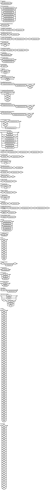

# Logic Language Grammar Specification

This document defines the formal grammar for a logic programming language, with detailed explanations and syntax diagrams.

## Table of Contents

- [Program Structure](#program-structure)
- [Statements](#statements)
- [Variable Declarations](#variable-declarations)
- [Function Declarations](#function-declarations)
- [Class Declarations](#class-declarations)
- [Expressions](#expressions)
- [Conditional Expression](#conditional-expression)
- [Function Calls](#function-calls)
- [Object Access](#object-access)
- [Object and Array Creation](#object-and-array-creation)
- [Iteration](#iteration)
- [Import Statement](#import-statement)
- [Return Statement](#return-statement)
- [Literals](#literals)
- [Identifiers](#identifiers)
- [Language Examples](#language-examples)


## Program Structure

```
Program → StatementList
```

**Explanation**: A program consists of a list of statements. This is the top-level rule that defines the overall structure of a program in this language.

**Syntax Diagram**:
```
Program: StatementList
┌────────────────┐
│  StatementList │
└────────────────┘
```

## Statements

```
StatementList → Statement | Statement StatementList
Statement → VariableDeclaration
            | FunctionDeclaration
            | ClassDeclaration
            | ExpressionStatement
            | ImportStatement
            | ReturnStatement
            | IterationStatement
ExpressionStatement → Expression
```

**Explanation**: A statement list is either a single statement or a statement followed by more statements. Statements can be variable declarations, function declarations, class declarations, expression statements, import statements, return statements, or iteration statements. An expression statement is simply an expression (e.g., a function call or an assignment).

**Syntax Diagram**:
```
StatementList:
┌────────────┐     ┌────────────────┐
│  Statement ├─────┤  StatementList │  (optional)
└────────────┘     └────────────────┘

Statement:
┌─────────────────────┐
│ VariableDeclaration │
├─────────────────────┤
│ FunctionDeclaration │
├─────────────────────┤
│ ClassDeclaration    │
├─────────────────────┤
│ ExpressionStatement │
├─────────────────────┤
│ ImportStatement     │
├─────────────────────┤
│ ReturnStatement     │
├─────────────────────┤
│ IterationStatement  │
└─────────────────────┘
```

## Variable Declarations

```
VariableDeclaration → "let" Identifier "=" Expression
VariableAssignment → Identifier "=" Expression
```

**Explanation**: Variable declarations start with the keyword `let`, followed by an identifier (the variable name), an equals sign, and an expression that provides the initial value. Variable assignments consist of an identifier, an equals sign, and the new value expression.

**Syntax Diagram**:
```
VariableDeclaration:
┌─────┐  ┌────────────┐  ┌───┐  ┌────────────┐
│ let ├──┤ Identifier ├──┤ = ├──┤ Expression │
└─────┘  └────────────┘  └───┘  └────────────┘

VariableAssignment:
┌────────────┐  ┌───┐  ┌────────────┐
│ Identifier ├──┤ = ├──┤ Expression │
└────────────┘  └───┘  └────────────┘
```

## Function Declarations

```
FunctionDeclaration → "fn" Identifier "(" ParameterList ")" "=" Expression
ParameterList → Identifier | Identifier "," ParameterList
```

**Explanation**: Function declarations start with the keyword `fn`, followed by an identifier (the function name), a parameter list in parentheses, an equals sign, and an expression that defines the function body. The parameter list can be a single identifier, or multiple identifiers separated by commas.

**Syntax Diagram**:
```
FunctionDeclaration:
┌────┐  ┌────────────┐  ┌───┐  ┌──────────────┐  ┌───┐  ┌───┐  ┌────────────┐
│ fn ├──┤ Identifier ├──┤ ( ├──┤ ParameterList ├──┤ ) ├──┤ = ├──┤ Expression │
└────┘  └────────────┘  └───┘  └──────────────┘  └───┘  └───┘  └────────────┘

ParameterList:
┌────────────┐
│ Identifier │───────────────────────────┐
└────────────┘                           │
       │                                 │
       ▼                                 │
┌─────┐  ┌──────────────┐               │
│  ,  ├──┤ ParameterList │               │
└─────┘  └──────────────┘               │
       └────────────────────────────────┘
```

## Class Declarations

```
ClassDeclaration → "class" Identifier "{" ClassBody "}"
ClassBody → ClassMember | ClassMember ClassBody
ClassMember → FunctionDeclaration | VariableDeclaration
```

**Explanation**: Class declarations start with the keyword `class`, followed by an identifier (the class name), and a class body enclosed in curly braces. The class body consists of one or more class members, each of which can be either a function declaration or a variable declaration.

**Syntax Diagram**:
```
ClassDeclaration:
┌───────┐  ┌────────────┐  ┌───┐  ┌───────────┐  ┌───┐
│ class ├──┤ Identifier ├──┤ { ├──┤ ClassBody ├──┤ } │
└───────┘  └────────────┘  └───┘  └───────────┘  └───┘

ClassBody:
┌────────────┐     ┌───────────┐
│ ClassMember ├─────┤ ClassBody │  (optional)
└────────────┘     └───────────┘

ClassMember:
┌─────────────────────┐
│ FunctionDeclaration │
├─────────────────────┤
│ VariableDeclaration │
└─────────────────────┘
```

## Expressions

```
Expression → <LogicOr>
LogicOr       → <LogicAnd> ( "or" <LogicAnd> )* ;
LogicAnd      → EqualityExpression ( "and" EqualityExpression )* ;
EqualityExpression → ComparisonExpression ("=="|"!=" EqualityExpression)*
ComparisonExpression → AdditiveExpression ( ( ">" | ">=" | "<" | "<=" ) AdditiveExpression )* ;
AdditiveExpression → MultiplicativeExpression ("+"|"-") AdditiveExpression
MultiplicativeExpression → UnaryExpression ("*"|"/" MultiplicativeExpression)*
UnaryExpression → ("+"|"-"|"!") <UnaryExpression>
                | <PrimaryExpression>
PrimaryExpression → <Literal>
                    | <Identifier>
                    | "(" <Expression> ")"
                    | <FunctionCall>
                    | <ConditionalExpression>
                    | <MemberAccess>
                    | <ArrayAccess>
                    | <ObjectCreation>
```

**Explanation**: Expressions follow a hierarchical structure that defines operator precedence. The grammar defines the following precedence levels (from lowest to highest):

1. Logical OR (`or`)
2. Logical AND (`and`)
3. Equality (`==`, `!=`)
4. Comparison (`>`, `>=`, `<`, `<=`)
5. Addition and subtraction (`+`, `-`)
6. Multiplication and division (`*`, `/`)
7. Unary operators (`+`, `-`, `!`)
8. Primary expressions (literals, identifiers, parenthesized expressions, function calls, etc.)

This ensures that expressions like `a + b * c` are parsed correctly (as `a + (b * c)`) rather than `(a + b) * c`.

**Syntax Diagram**
```
Expression Hierarchy:
┌─────────┐
│ LogicOr │
└─────────┘
     ▲
     │
┌──────────┐
│ LogicAnd │
└──────────┘
     ▲
     │
┌────────────────────┐
│ EqualityExpression │
└────────────────────┘
     ▲
     │
┌─────────────────────┐
│ ComparisonExpression │
└─────────────────────┘
     ▲
     │
┌────────────────────┐
│ AdditiveExpression │
└────────────────────┘
     ▲
     │
┌────────────────────────┐
│ MultiplicativeExpression │
└────────────────────────┘
     ▲
     │
┌────────────────┐
│ UnaryExpression │
└────────────────┘
     ▲
     │
┌───────────────────┐
│ PrimaryExpression │
└───────────────────┘
```

## Conditional Expression

```
ConditionalExpression → "If" "<" <Expression> "," <Expression> "," <Expression> ">"
```

**Explanation**: Conditional expressions use a unique syntax with the `If` keyword followed by angle brackets containing three expressions separated by commas. The first expression is the condition, the second is the value if the condition is true, and the third is the value if the condition is false. This is similar to the ternary operator in other languages but with a different syntax.

**Syntax Diagram**:
```
ConditionalExpression:
┌────┐  ┌───┐  ┌────────────┐  ┌───┐  ┌────────────┐  ┌───┐  ┌────────────┐  ┌───┐
│ If ├──┤ < ├──┤ Expression ├──┤ , ├──┤ Expression ├──┤ , ├──┤ Expression ├──┤ > │
└────┘  └───┘  └────────────┘  └───┘  └────────────┘  └───┘  └────────────┘  └───┘
   condition           true value           false value
```

## Function Calls

```
FunctionCall → Identifier "(" ArgumentList ")"
ArgumentList → Expression | Expression "," ArgumentList
```

**Explanation**: Function calls consist of an identifier (the function name) followed by an argument list in parentheses. The argument list can be a single expression, or multiple expressions separated by commas

**Syntax Diagram**:
```
FunctionCall:
┌────────────┐  ┌───┐  ┌─────────────┐  ┌───┐
│ Identifier ├──┤ ( ├──┤ ArgumentList ├──┤ ) │
└────────────┘  └───┘  └─────────────┘  └───┘

ArgumentList:
┌────────────┐
│ Expression │────────────────────────┐
└────────────┘                        │
       │                              │
       ▼                              │
┌─────┐  ┌─────────────┐             │
│  ,  ├──┤ ArgumentList │             │
└─────┘  └─────────────┘             │
       └───────────────────────────────┘
```

## Object Access

```
MemberAccess → PrimaryExpression "." Identifier
ArrayAccess → Identifier "[" Expression "]"
```

**Explanation**: Member access uses dot notation to access properties of objects, while array access uses square bracket notation to access elements of arrays by index.

**Syntax Diagram**:
```
MemberAccess:
┌───────────────────┐  ┌───┐  ┌────────────┐
│ PrimaryExpression ├──┤ . ├──┤ Identifier │
└───────────────────┘  └───┘  └────────────┘

ArrayAccess:
┌────────────┐  ┌───┐  ┌────────────┐  ┌───┐
│ Identifier ├──┤ [ ├──┤ Expression ├──┤ ] │
└────────────┘  └───┘  └────────────┘  └───┘
```

## Object and Array Creation

```
ObjectCreation → Identifier "{" "}"
ArrayLiteral → "[" ElementList "]"
ElementList → Expression | Expression "," ElementList
ObjectLiteral → "{" PropertyList "}"
PropertyList → Property | Property "," PropertyList
Property → Identifier ":" Expression
```

**Explanation**: Object creation involves an identifier followed by empty curly braces. Array literals consist of a list of elements enclosed in square brackets. Object literals consist of a list of properties enclosed in curly braces. Each property consists of an identifier, a colon, and an expression.

**Syntax Diagram**:
```
ObjectCreation:
┌────────────┐  ┌───┐  ┌───┐
│ Identifier ├──┤ { ├──┤ } │
└────────────┘  └───┘  └───┘

ArrayLiteral:
┌───┐  ┌────────────┐  ┌───┐
│ [ ├──┤ ElementList ├──┤ ] │
└───┘  └────────────┘  └───┘

ElementList:
┌────────────┐
│ Expression │────────────────────┐
└────────────┘                    │
       │                          │
       ▼                          │
┌─────┐  ┌────────────┐          │
│  ,  ├──┤ ElementList │          │
└─────┘  └────────────┘          │
       └─────────────────────────┘

ObjectLiteral:
┌───┐  ┌──────────────┐  ┌───┐
│ { ├──┤ PropertyList ├──┤ } │
└───┘  └──────────────┘  └───┘

PropertyList:
┌──────────┐
│ Property │────────────────────┐
└──────────┘                    │
       │                        │
       ▼                        │
┌─────┐  ┌──────────────┐      │
│  ,  ├──┤ PropertyList │      │
└─────┘  └──────────────┘      │
       └─────────────────────────┘

Property:
┌────────────┐  ┌───┐  ┌────────────┐
│ Identifier ├──┤ : ├──┤ Expression │
└────────────┘  └───┘  └────────────┘
```

## Iteration

```
IterationStatement → "Range" "<" Expression "," Expression ">" "{" StatementList "}"
```

**Explanation**: Iteration statements use the `Range` keyword followed by two expressions in angle brackets that define the range (usually start and end values), and a block of statements enclosed in curly braces. This is similar to a for loop in other languages.

**Syntax Diagram**:
```
IterationStatement:
┌───────┐  ┌───┐  ┌────────────┐  ┌───┐  ┌────────────┐  ┌───┐  ┌───┐  ┌────────────┐  ┌───┐
│ Range ├──┤ < ├──┤ Expression ├──┤ , ├──┤ Expression ├──┤ > ├──┤ { ├──┤ Statement  ├──┤ } │
└───────┘  └───┘  └────────────┘  └───┘  └────────────┘  └───┘  └───┘  └────────────┘  └───┘
            start value              end value                  statements to execute
```

## Import Statement

```
ImportStatement → "import" <StringLiteral>
```

**Explanation**: Import statements use the `import` keyword followed by a string literal that specifies the module to import.

**Syntax Diagram**:
```
ImportStatement:
┌────────┐  ┌──────────────┐
│ import ├──┤ StringLiteral │
└────────┘  └──────────────┘
```

## Return Statement

```
ReturnStatement → "return" <Expression>
```

**Explanation**: Return statements use the `return` keyword followed by an expression that specifies the value to return.

**Syntax Diagram**:
```
ReturnStatement:
┌────────┐  ┌────────────┐
│ return ├──┤ Expression │
└────────┘  └────────────┘
```

## Literals

```
Literal → <NumberLiteral>
            | <StringLiteral>
            | <BooleanLiteral>
            | <ArrayLiteral>
            | <ObjectLiteral>
NumberLiteral → Digit | Digit NumberLiteral
Digit → "0" | "1" | "2" | "3" | "4" | "5" | "6" | "7" | "8" | "9"
StringLiteral → "\"" Characters "\""
Characters → Character | Character Characters
Character → Letter | Digit | Symbol
BooleanLiteral → "true" | "false"
```

**Explanation**: Literals are values that appear directly in the source code. They can be numbers, strings, booleans, arrays, or objects. Number literals consist of one or more digits. String literals are sequences of characters enclosed in double quotes. Boolean literals are the keywords `true` and `false`. Array literals and object literals are as defined in the [Object and Array Creation](#object-and-array-creation) section.

**Syntax Diagram**:
```
Literal:
┌──────────────┐
│ NumberLiteral │
├──────────────┤
│ StringLiteral │
├──────────────┤
│ BooleanLiteral │
├──────────────┤
│ ArrayLiteral  │
├──────────────┤
│ ObjectLiteral │
└──────────────┘

NumberLiteral:
┌───────┐     ┌──────────────┐
│ Digit ├─────┤ NumberLiteral │  (optional)
└───────┘     └──────────────┘

Digit:
┌───┐
│ 0 │
├───┤
│ 1 │
├───┤
│ 2 │
├───┤
│ 3 │
├───┤
│ 4 │
├───┤
│ 5 │
├───┤
│ 6 │
├───┤
│ 7 │
├───┤
│ 8 │
├───┤
│ 9 │
└───┘

StringLiteral:
┌───┐  ┌───────────┐  ┌───┐
│ " ├──┤ Characters ├──┤ " │
└───┘  └───────────┘  └───┘

BooleanLiteral:
┌──────┐
│ true │
├──────┤
│ false │
└──────┘
```

## Identifiers

```
Identifier → Letter | Letter AlphaNumeric
AlphaNumeric → Letter | Digit | "_" | Letter AlphaNumeric | Digit AlphaNumeric | "_" AlphaNumeric
Letter → "a" | "b" | ... | "z" | "A" | "B" | ... | "Z"
Symbol → "!" | "@" | "#" | "$" | "%" | "^" | "&" | "*" | "(" | ")" | "-" | "+" | "=" | "{" | "}" | "[" | "]" | ":" | ";" | "," | "." | "<" | ">" | "/" | "?" | "|" | "\"" | "'" | "`" | "~"
```

**Explanation**: Identifiers are names used to identify variables, functions, classes, etc. They must start with a letter and can be followed by any combination of letters, digits, and underscores. Symbols are special characters that can be used in various contexts, such as operators and punctuation.

**Syntax Diagram**:
```
Identifier:
┌────────┐     ┌─────────────┐
│ Letter ├─────┤ AlphaNumeric │  (optional)
└────────┘     └─────────────┘

AlphaNumeric:
┌────────┐
│ Letter │
├────────┤
│ Digit  │
├────────┤
│   _    │
└────────┘
```

## Language Examples

### Variable Declaration
```
let x = 10
let name = "John"
```

**Explanation**: These examples show the declaration of variables with initial values. The first variable `x` is initialized with a number literal, and the second variable `name` is initialized with a string literal.

### Function Declaration
```
fn add(a, b) = a + b
fn greet(name) = "Hello " + name
```

**Explanation**: These examples show the declaration of functions. The `add` function takes two parameters and returns their sum. The `greet` function takes a name parameter and returns a greeting string.

### Conditional Expression
```
If<x > 10, "Greater", "Less or Equal">
```

**Explanation**: This example shows a conditional expression that checks if `x` is greater than 10. If it is, the expression evaluates to the string "Greater"; otherwise, it evaluates to the string "Less or Equal".

### Iteration
```
Range<0, 10> {
    print(i)
}
```

**Explanation**: This example shows an iteration statement that iterates from 0 to 10 (inclusive of 0, exclusive of 10) and prints the value of the iteration variable `i` for each iteration.

### Object and Array Usage
```
let array = [1, 2, 3, 4]
let element = array[0]

let person = {name: "John", age: 30}
let name = person.name
```

**Explanation**: These examples show the creation and usage of arrays and objects. An array is created with number literals, and an element is accessed using array access notation. An object is created with properties for name and age, and a property is accessed using member access notation.

### Class Declaration
```
class Person {
    let name = ""
    let age = 0

    fn getName() = name
    fn setName(newName) = name = newName
}
```

**Explanation**: This example shows the declaration of a class. The `Person` class has two member variables (`name` and `age`) and two methods (`getName` and `setName`). The `getName` method returns the value of the `name` variable, and the `setName` method sets the value of the `name` variable to a new value.



